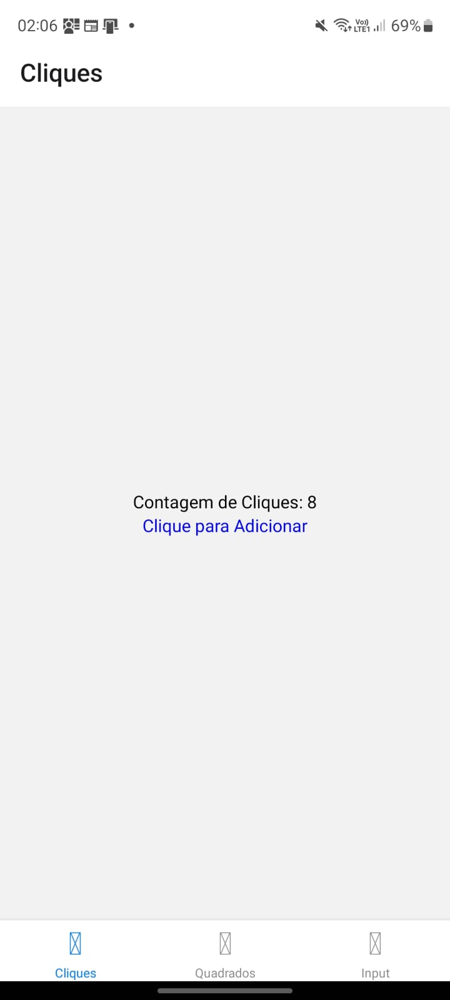
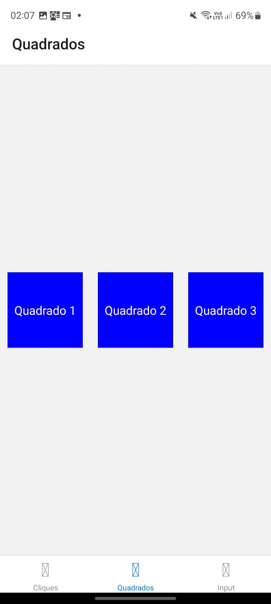
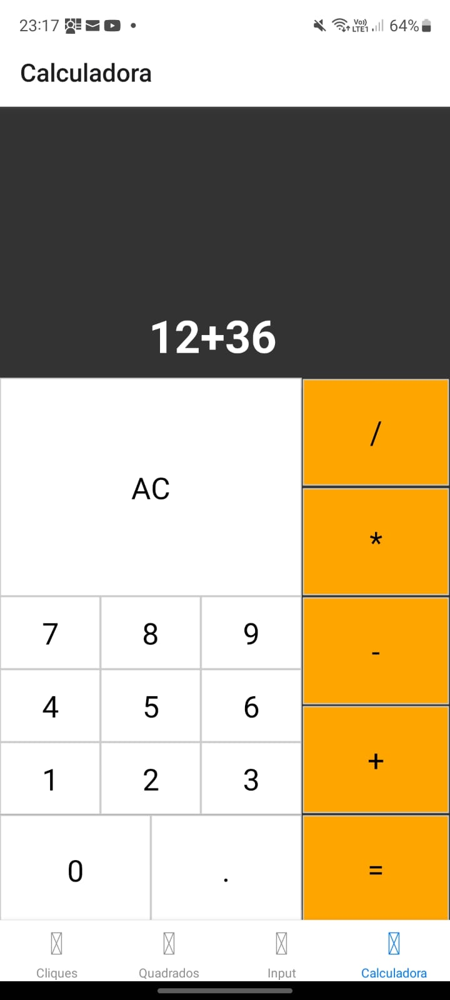

# Desenvolvimento_Mobile_UFC

## Tarefa 1
Contador de cliques, ao clicar no texto em azul

## Tarefa 2
Alinhamento de três quadrados na horizontal

## Tarefa 3
Input que escreve na tela conforme o usuário digita

## Tarefa 4
Calculadora com as 4 principais operações (soma, subtração, divisão e multiplicação)

